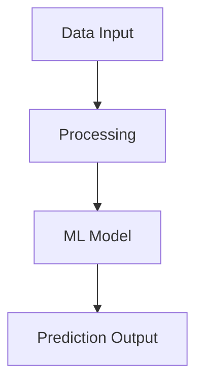

# Steel Defect Prediction System - Documentation

This directory contains the comprehensive documentation for the Steel Defect Prediction System, built with [MkDocs](https://www.mkdocs.org/) and the [Material theme](https://squidfunk.github.io/mkdocs-material/).

## 📚 Documentation Structure

```
docs_site/
├── index.md                          # Landing page
├── getting-started/                  # Quick start guides
│   ├── quick-start.md               # 5-minute setup
│   ├── system-requirements.md       # Hardware/software requirements  
│   └── first-prediction.md          # First prediction tutorial
├── installation/                     # Installation guides
│   ├── development-setup.md         # Development environment
│   ├── production-deployment.md     # Production installation
│   ├── docker-installation.md      # Container deployment
│   └── troubleshooting.md          # Installation troubleshooting
├── user-guide/                      # User documentation
│   ├── dashboard-overview.md        # Dashboard guide
│   ├── real-time-monitoring.md     # Live monitoring
│   ├── model-comparison.md         # Model performance analysis
│   ├── historical-analysis.md      # Data analysis tools
│   ├── alert-management.md         # Alert configuration
│   └── user-preferences.md         # User customization
├── api-reference/                   # API documentation
│   ├── dashboard-integration.md     # Dashboard API
│   ├── prediction-endpoints.md     # Prediction APIs
│   ├── data-endpoints.md          # Data management
│   └── monitoring-endpoints.md     # System monitoring
├── architecture/                    # System architecture
│   ├── system-overview.md          # High-level architecture
│   ├── data-pipeline.md           # Data processing flow
│   ├── ml-pipeline.md             # ML model pipeline
│   ├── security-model.md          # Security architecture
│   └── deployment-topology.md     # Infrastructure layout
├── operations/                      # Operations guides
│   ├── monitoring.md              # System monitoring
│   ├── maintenance.md             # Maintenance procedures
│   ├── backup-recovery.md         # Backup/recovery
│   ├── performance-tuning.md      # Performance optimization
│   └── incident-response.md       # Emergency procedures
├── development/                     # Developer documentation
│   ├── code-structure.md          # Code organization
│   ├── development-workflow.md    # Git workflow
│   ├── testing-guidelines.md      # Testing standards
│   ├── coding-standards.md        # Code style guide
│   └── contributing.md            # Contribution guide
├── tutorials/                       # Tutorial materials
│   ├── basic-usage.md             # Basic system usage
│   ├── advanced-features.md       # Advanced functionality
│   ├── integration-examples.md    # Integration tutorials
│   └── customization.md           # Customization guide
├── releases/                        # Release documentation
│   ├── changelog.md               # Version history
│   ├── migration-guides.md        # Upgrade procedures
│   └── compatibility.md           # Version compatibility
├── assets/                          # Documentation assets
│   ├── images/                    # Screenshots and diagrams
│   ├── videos/                    # Tutorial videos
│   └── downloads/                 # Downloadable resources
├── stylesheets/                     # Custom CSS
└── javascripts/                     # Custom JavaScript
```

## 🚀 Quick Start

### View Documentation Locally

```bash
# Install documentation dependencies
pip install -r requirements-docs.txt

# Serve documentation with live reload
mkdocs serve

# Open browser to http://localhost:8000
```

### Build Static Site

```bash
# Build documentation to site/ directory
mkdocs build

# Build with strict warnings (for CI/CD)
mkdocs build --strict
```

## 🛠️ Development

### Adding New Pages

1. **Create Markdown file** in appropriate directory:
   ```bash
   touch docs_site/user-guide/new-feature.md
   ```

2. **Add to navigation** in `mkdocs.yml`:
   ```yaml
   nav:
     - User Guide:
       - New Feature: user-guide/new-feature.md
   ```

3. **Write content** using Markdown with MkDocs extensions

### Documentation Standards

#### Writing Style
- Use clear, concise language
- Include practical examples
- Add code snippets for technical content
- Use proper headings hierarchy (H1 → H2 → H3)

#### Code Examples
````markdown
```python
# Always include comments in code examples
from src.models.baseline_model import BaselineModel

# Initialize and use the model
model = BaselineModel()
result = model.predict(sensor_data)
print(f"Defect probability: {result['defect_probability']}")
```
````

#### Admonitions
```markdown
!!! note "Important Information"
    Use notes for important information that users should know.

!!! warning "Potential Issues"
    Use warnings for things that could cause problems.

!!! tip "Pro Tips"
    Use tips for helpful suggestions and best practices.
```

#### Diagrams
Use Mermaid for system diagrams:

````markdown

````

### Custom Styling

The documentation uses custom CSS in `stylesheets/extra.css`:

- **Steel Blue Theme**: Professional appearance matching the domain
- **Orange Accents**: Highlighting important elements
- **Responsive Design**: Mobile-friendly layouts
- **Custom Components**: Grid cards, enhanced tables

### Advanced Features

#### Interactive Elements
- **Tabbed Content**: For multiple installation methods
- **Collapsible Sections**: For detailed technical information
- **Code Copy Buttons**: Automatic copy-to-clipboard functionality

#### Search Functionality
- **Full-text Search**: Powered by Lunr.js
- **Instant Results**: Real-time search as you type
- **Smart Highlighting**: Search term highlighting in results

## 📝 Content Guidelines

### Documentation Types

| Type | Purpose | Audience | Examples |
|------|---------|----------|----------|
| **Tutorials** | Learning-oriented | Beginners | Quick start, first prediction |
| **How-to Guides** | Problem-oriented | Intermediate | Installation, troubleshooting |
| **Reference** | Information-oriented | All levels | API docs, configuration |
| **Explanation** | Understanding-oriented | Advanced | Architecture, design decisions |

### Writing Checklist

- [ ] Clear, descriptive headings
- [ ] Consistent tone and style
- [ ] Working code examples
- [ ] Proper cross-references
- [ ] Screenshots where helpful
- [ ] Mobile-friendly formatting

### Technical Writing Best Practices

1. **Start with Context**: Explain what the reader will learn
2. **Use Active Voice**: "Configure the system" vs "The system should be configured"
3. **Include Prerequisites**: What knowledge/setup is needed
4. **Provide Examples**: Show don't just tell
5. **Test Instructions**: Verify all steps work correctly

## 🔧 Technical Configuration

### MkDocs Configuration

Key settings in `mkdocs.yml`:

```yaml
# Theme and appearance
theme:
  name: material
  palette:
    - scheme: default
      primary: blue grey
      accent: deep orange

# Enhanced markdown features  
markdown_extensions:
  - pymdownx.superfences
  - pymdownx.tabbed
  - admonition
  - pymdownx.details
  - pymdownx.emoji

# Plugins for advanced functionality
plugins:
  - search
  - mermaid2
  - swagger-ui-tag
```

### Build Dependencies

Required packages in `requirements-docs.txt`:

- `mkdocs>=1.4.0` - Core documentation generator
- `mkdocs-material>=8.5.0` - Material theme
- `mkdocs-mermaid2-plugin>=0.6.0` - Diagram support
- `pymdown-extensions>=9.8.0` - Enhanced markdown
- `mkdocs-swagger-ui-tag>=0.6.0` - API documentation

## 🚀 Deployment

### Automated Deployment

Documentation is automatically deployed via GitHub Actions:

- **Trigger**: Push to `main` branch with documentation changes
- **Build**: MkDocs generates static site
- **Deploy**: Published to GitHub Pages
- **URL**: Available at project GitHub Pages URL

### Manual Deployment

```bash
# Build and deploy to GitHub Pages
mkdocs gh-deploy --clean

# Deploy to custom server
mkdocs build
rsync -av site/ user@server:/var/www/docs/
```

## 🔍 Quality Assurance

### Automated Checks

The documentation undergoes several automated quality checks:

1. **Build Validation**: Ensures documentation builds without errors
2. **Link Checking**: Validates internal and external links
3. **Markdown Linting**: Checks formatting and style consistency
4. **Content Validation**: Verifies code examples and references

### Manual Review Process

Before publishing major updates:

- [ ] Technical accuracy review
- [ ] Editorial review for clarity
- [ ] User testing with actual workflows
- [ ] Cross-platform compatibility check
- [ ] Mobile responsiveness verification

## 📊 Analytics and Feedback

### Usage Analytics

The documentation includes:

- **Page View Tracking**: Monitor popular content
- **Search Analytics**: Track common queries
- **User Feedback**: Thumbs up/down on pages
- **Navigation Patterns**: Understand user journeys

### Continuous Improvement

Based on analytics and feedback:

- **Content Updates**: Regular updates to popular pages
- **New Content**: Address common questions
- **Structure Improvements**: Optimize navigation
- **Performance Optimization**: Faster loading times

## 🤝 Contributing to Documentation

### Getting Started

1. **Fork Repository**: Create your own copy
2. **Create Branch**: `git checkout -b docs/your-improvement`
3. **Make Changes**: Edit documentation files
4. **Test Locally**: `mkdocs serve` to preview
5. **Submit PR**: Create pull request with changes

### Contribution Types

- **Fix Typos**: Simple text corrections
- **Add Examples**: More code examples and use cases
- **Improve Clarity**: Better explanations and organization
- **Add Content**: New tutorials and guides
- **Update Screenshots**: Keep visuals current

### Review Process

Documentation changes follow the same review process as code:

1. **Automated Checks**: Linting and build validation
2. **Peer Review**: Review by team members
3. **Testing**: Verify instructions work correctly
4. **Approval**: Maintainer approval required
5. **Deployment**: Automatic deployment to live site

## 📞 Support

### Getting Help

- **Documentation Issues**: [GitHub Issues](https://github.com/dhar174/steel_defect_demo/issues)
- **Content Questions**: [GitHub Discussions](https://github.com/dhar174/steel_defect_demo/discussions)
- **Technical Support**: See [Support Guide](user-guide/dashboard-overview.md#getting-help)

### Feedback

We welcome feedback on documentation:

- **Page Feedback**: Use thumbs up/down on each page
- **General Feedback**: Open GitHub issue or discussion
- **Content Requests**: Suggest new documentation topics

---

**Thank you for helping improve our documentation!** 📚

The comprehensive documentation system enables users, developers, and operators to effectively use and contribute to the Steel Defect Prediction System.