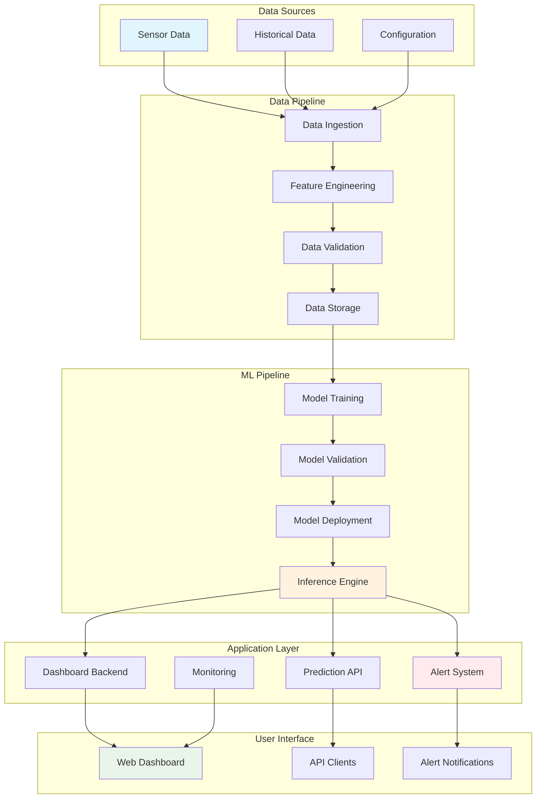
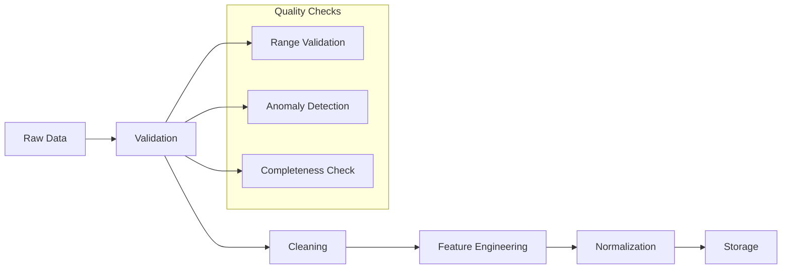
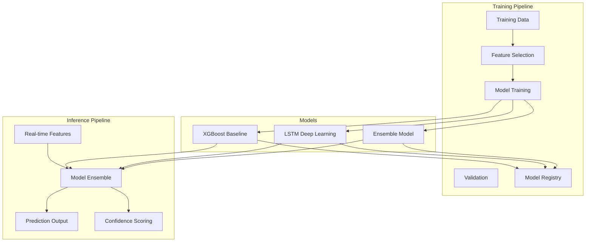
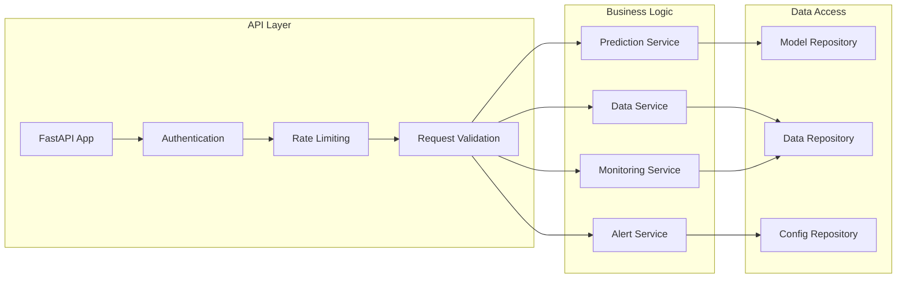
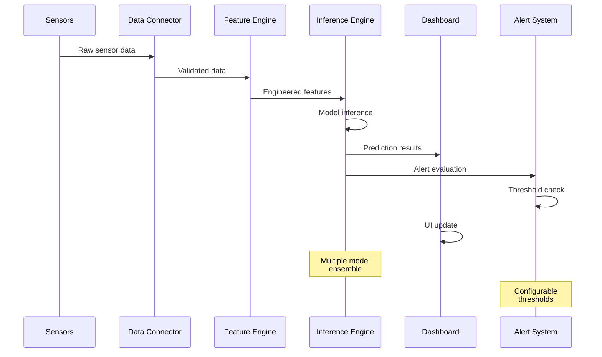
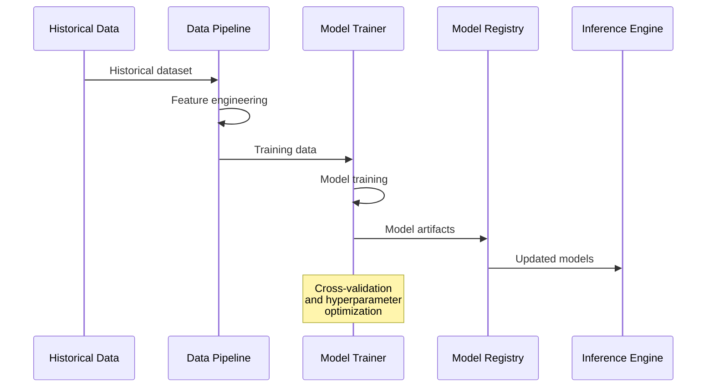
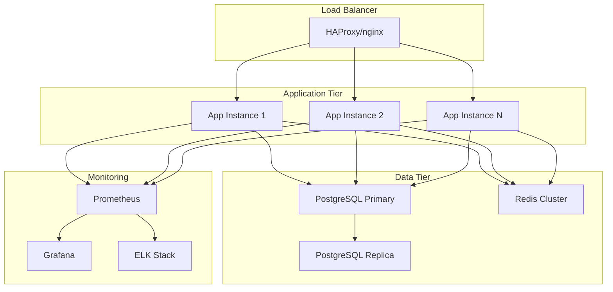
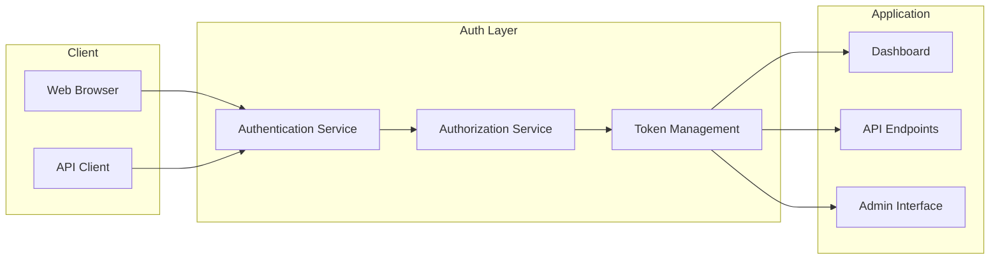
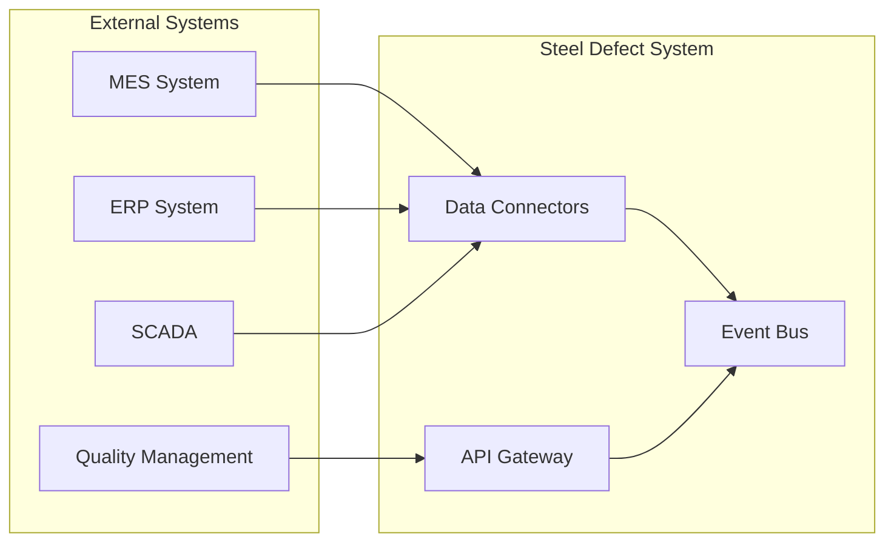

# System Architecture Overview

This document provides a comprehensive overview of the Steel Defect Prediction System architecture, including components, data flow, and integration patterns.

## High-Level Architecture



## Component Architecture

### 1. Data Layer

#### Data Sources
- **Sensor Systems**: Real-time sensor data streams
- **Historical Database**: Historical casting data
- **Configuration Store**: System and model configurations
- **External Systems**: ERP, MES integration

#### Data Storage
```
data/
├── raw/                 # Raw sensor data
├── processed/          # Cleaned and validated data
├── features/           # Engineered features
├── models/             # Trained model artifacts
└── results/            # Prediction results
```

### 2. Processing Layer

#### Data Pipeline Components



#### Key Components
- **Data Ingestion**: `src/connectors/data_connectors.py`
- **Feature Engineering**: `src/features/feature_engineering.py`
- **Data Validation**: `src/data/data_validation.py`
- **Storage Management**: `src/data/data_storage.py`

### 3. Machine Learning Layer

#### Model Architecture



#### Model Components
- **Baseline Model**: XGBoost classifier with engineered features
- **Deep Learning**: LSTM for sequence modeling
- **Ensemble**: Weighted combination of multiple models
- **Feature Engineering**: Automated feature extraction and selection

### 4. Application Layer

#### Service Architecture

```python
# Core application structure
src/
├── models/              # ML model implementations
│   ├── baseline_model.py
│   ├── lstm_model.py
│   └── model_trainer.py
├── inference/           # Prediction engine
│   ├── prediction_engine.py
│   └── inference_pipeline.py
├── visualization/       # Dashboard components
│   ├── dashboard.py
│   └── components/
├── monitoring/          # System monitoring
│   ├── alert_system.py
│   └── health_checks.py
└── utils/              # Shared utilities
    ├── config.py
    └── logging.py
```

#### API Design



### 5. User Interface Layer

#### Dashboard Architecture

The dashboard is built using Dash (Plotly) with a component-based architecture:

```python
# Dashboard component structure
src/visualization/
├── dashboard.py         # Main dashboard app
├── components/          # Reusable UI components
│   ├── __init__.py
│   ├── prediction_display.py
│   ├── model_comparison.py
│   ├── historical_analysis.py
│   ├── alert_management.py
│   └── sensor_monitoring.py
├── layouts/            # Page layouts
├── callbacks/          # Interactive callbacks
└── utils/             # UI utilities
```

## Data Flow Architecture

### Real-time Prediction Flow



### Batch Processing Flow



## Technology Stack

### Core Technologies

| Layer | Technology | Purpose |
|-------|------------|---------|
| **ML Framework** | PyTorch, scikit-learn, XGBoost | Model development and training |
| **Data Processing** | pandas, NumPy, PyArrow | Data manipulation and analysis |
| **Web Framework** | Dash, Plotly | Interactive dashboard |
| **API Framework** | FastAPI | RESTful API services |
| **Database** | SQLite/PostgreSQL | Data persistence |
| **Caching** | Redis | High-performance caching |

### Development Tools

| Category | Tools |
|----------|-------|
| **Language** | Python 3.8+ |
| **Testing** | pytest, unittest |
| **Linting** | flake8, black, mypy |
| **Documentation** | MkDocs, Sphinx |
| **Containerization** | Docker, docker-compose |
| **CI/CD** | GitHub Actions |

## Deployment Architecture

### Development Environment

```yaml
# Local development stack
services:
  app:
    build: .
    ports:
      - "8050:8050"
    volumes:
      - .:/app
    environment:
      - ENV=development
      
  database:
    image: postgres:13
    environment:
      - POSTGRES_DB=steel_defect
      
  redis:
    image: redis:6-alpine
```

### Production Environment



## Security Architecture

### Authentication and Authorization



### Security Measures

- **Authentication**: Token-based authentication
- **Authorization**: Role-based access control (RBAC)
- **Data Encryption**: TLS/SSL for data in transit
- **Input Validation**: Comprehensive request validation
- **Rate Limiting**: API rate limiting and throttling
- **Audit Logging**: Security event logging

## Scalability Considerations

### Horizontal Scaling

- **Stateless Design**: Application instances are stateless
- **Load Balancing**: Multiple app instances behind load balancer
- **Database Scaling**: Read replicas and connection pooling
- **Caching Strategy**: Distributed caching with Redis cluster

### Performance Optimization

- **Model Optimization**: Model quantization and optimization
- **Data Pipeline**: Parallel processing and streaming
- **Frontend**: Lazy loading and caching
- **API**: Async processing and connection pooling

## Integration Patterns

### External System Integration



### Integration Methods

- **REST APIs**: Standard HTTP/JSON APIs
- **WebSockets**: Real-time data streaming
- **Message Queues**: Asynchronous processing
- **File Transfer**: Batch data exchange
- **Database Integration**: Direct database connections

---

Next: [Contributing Guide →](../development/contributing.md)