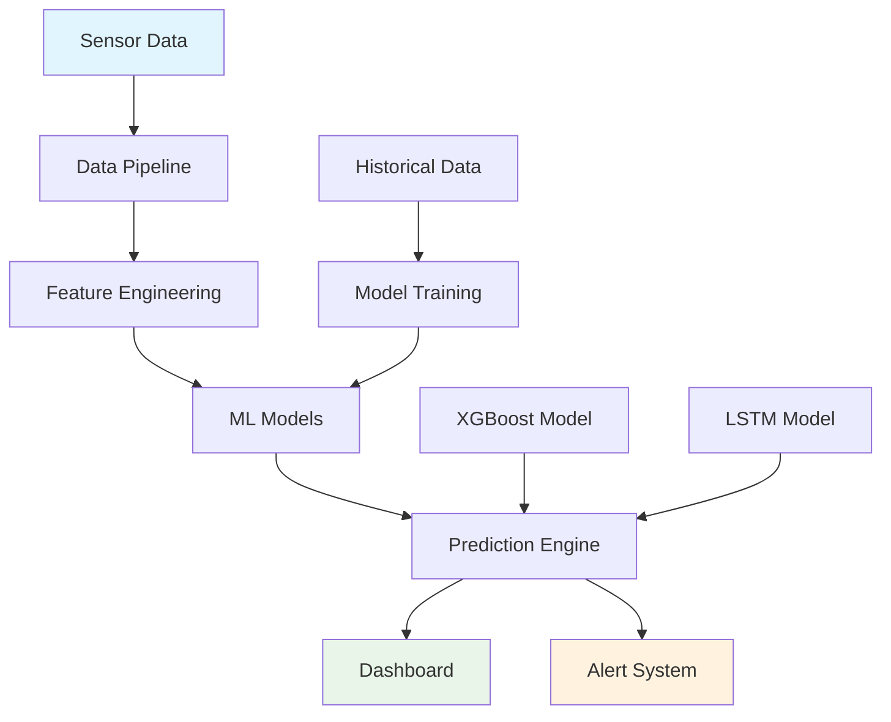

# Steel Defect Prediction System Documentation

-   :material-rocket-launch:{ .lg .middle } __Getting Started__

    ---

    Get up and running quickly with our steel casting defect prediction system

    [:octicons-arrow-right-24: Quick Start](getting-started/quick-start.md)

-   :material-view-dashboard:{ .lg .middle } __User Guide__

    ---

    Complete guide to using the dashboard and monitoring interface

    [:octicons-arrow-right-24: Dashboard Overview](user-guide/dashboard-overview.md)

-   :material-api:{ .lg .middle } __API Reference__

    ---

    Comprehensive API documentation with interactive examples

    [:octicons-arrow-right-24: API Docs](api-reference/prediction-endpoints.md)

-   :material-sitemap:{ .lg .middle } __Architecture__

    ---

    Deep dive into system architecture and design decisions

    [:octicons-arrow-right-24: System Overview](architecture/system-overview.md)

## Overview

The **Steel Defect Prediction System** is a comprehensive machine learning solution designed for continuous steel casting operations. It provides real-time defect prediction, quality monitoring, and advanced analytics to help optimize casting processes and reduce product defects.

### Key Features

- **Real-time Prediction**: ML-powered defect prediction using multiple model types (XGBoost, LSTM)
- **Interactive Dashboard**: Comprehensive monitoring interface with Dash framework
- **Historical Analysis**: Advanced analytics for process optimization
- **Alert Management**: Configurable alerting system for proactive quality control
- **Multi-model Comparison**: Side-by-side model performance evaluation

## Quick Navigation

### For New Users
- [Quick Start Guide](getting-started/quick-start.md) - Get running in 5 minutes
- [System Requirements](getting-started/system-requirements.md) - Hardware and software prerequisites
- [First Prediction](getting-started/first-prediction.md) - Your first defect prediction

### For Operators
- [Dashboard Overview](user-guide/dashboard-overview.md) - Navigate the monitoring interface
- [Real-time Monitoring](user-guide/real-time-monitoring.md) - Live process monitoring
- [Alert Management](user-guide/alert-management.md) - Configure and manage alerts

### For Developers
- [Development Setup](installation/development-setup.md) - Set up development environment
- [Code Structure](development/code-structure.md) - Understand the codebase
- [Contributing Guide](development/contributing.md) - How to contribute

### For System Administrators
- [Production Deployment](installation/production-deployment.md) - Deploy to production
- [Operations Guide](operations/monitoring.md) - Monitor and maintain the system
- [Security Model](architecture/security-model.md) - Security considerations

## System Architecture

## Technology Stack

- **Machine Learning**: XGBoost, PyTorch, scikit-learn
- **Dashboard**: Dash, Plotly, Bootstrap
- **Data Processing**: pandas, NumPy, PyArrow
- **Infrastructure**: Docker, Python 3.8+
- **Documentation**: MkDocs Material

## Latest Updates

!!! tip "Version 0.1.0"
    - Initial release with baseline XGBoost and LSTM models
    - Complete dashboard interface with real-time monitoring
    - Comprehensive alerting system
    - Historical analysis and model comparison tools

## Support

- **Documentation**: Browse this comprehensive guide
- **Issues**: [GitHub Issues](https://github.com/dhar174/steel_defect_demo/issues)
- **Discussions**: [GitHub Discussions](https://github.com/dhar174/steel_defect_demo/discussions)

---

*Last updated: {{ now().strftime('%B %d, %Y') }}*